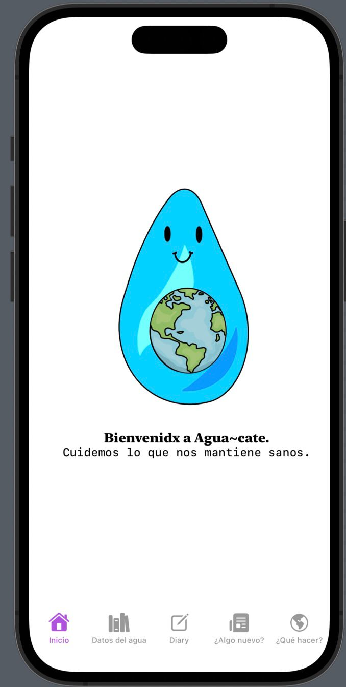
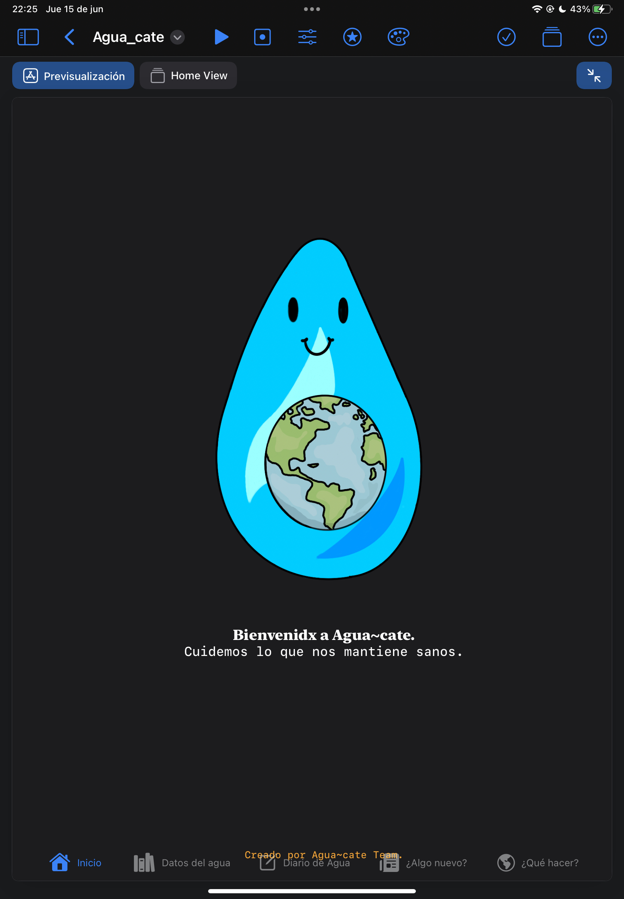

# <em> Agua~cate App </em>

**Agua~cate App fue un proyecto realizado en Swift para la materia de Programación Orientada a Objetos impartida en la Facultad de Ingeniería de la UNAM.**

 

**Contenido**
---
### 1. Descripción.
### 2. Tecnologías utilizadas.
***
**1. Descripción.**
---
### Este proyecto es el resultado del aprendizaje obtenido a lo largo de mi sexto semestre en la materia Programación Orientada a Objetos impartida por la Ingeniera Guadalupe Lizeth Parrales Romay.
### El propósito de la aplicación es concientizar y educar acerca del cuidado del agua y su saneamiento en México. Esto para ayudar a resolver el punto número seis de las metas de Desarrollo Sustentable propuestas por la OMS.
***
**2. Tecnologías utilizadas.**
---
### Todo el proyecto se realizó utilizando el lenguaje de programación Swift y el entorno de desarrollo de SwiftUI, utilizando el IDE Xcode y Swift Playgrounds.
***