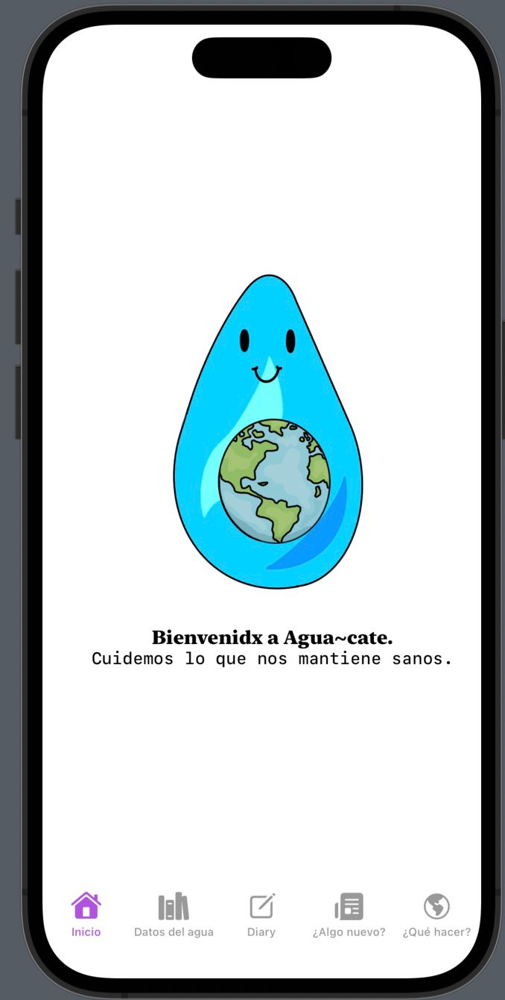
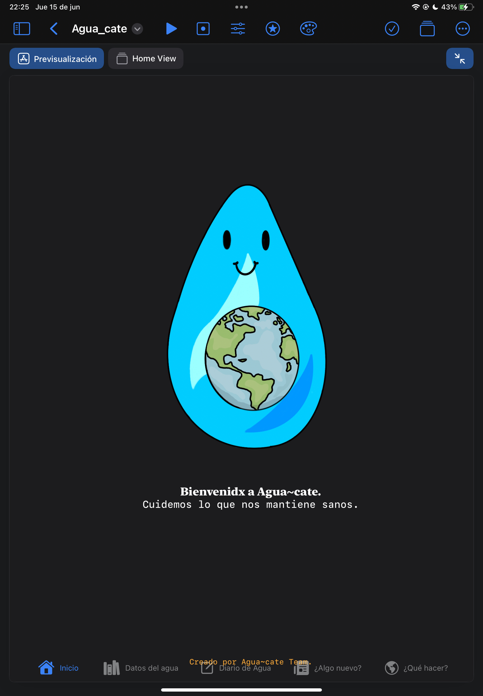

# Agua~cate App: Water Conservation & Awareness

> **Swift-based mobile application focused on sustainable development and environmental education.**

---

## 🖥️ Tech Stack
- **Language:** Swift
- **Framework:** SwiftUI
- **IDE:** Xcode / Swift Playgrounds

---

## 🗒️ Description

**Agua~cate App** is a mobile application developed to raise awareness about water conservation and sanitation in Mexico. This project aligns with the **United Nations Sustainable Development Goal #6 (Clean Water and Sanitation)**, aiming to educate users on responsible water consumption and the importance of sustainable resource management.

The application leverages native iOS design principles to deliver an intuitive and educational user experience, translating complex environmental challenges into accessible, community-focused information.

---

## 💡 Core Functionalities
- **Educational Modules:** Informative content regarding water footprint and conservation techniques.
- **Sustainable Goal Tracking:** Educational awareness aligned with WHO and UN sustainability metrics.
- **Intuitive UI/UX:** Built using SwiftUI to provide a responsive and clean interface, ensuring high accessibility for users of all ages.

   
  

---

## 🪪 About the Project

This application was developed as the final project for the **Object-Oriented Programming (POO)** course at the **Faculty of Engineering, UNAM**, under the supervision of Professor Guadalupe Lizeth Parrales Romay.

It demonstrates proficiency in **iOS native development, Object-Oriented Programming paradigms, and mobile UI/UX design** within the Apple ecosystem. This project highlights my capability to apply technical software engineering skills toward meaningful, community-impact initiatives.

---
*Developed by Gerardo Santana.*
